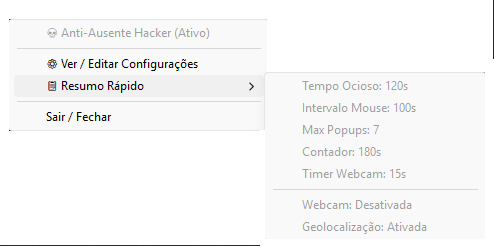
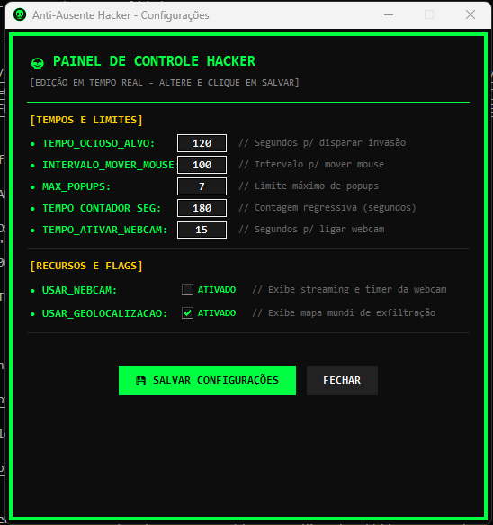
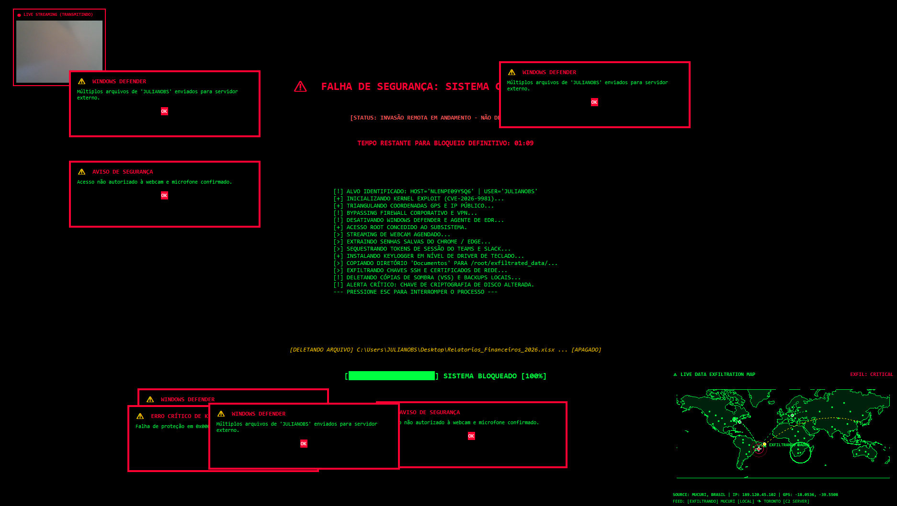

# Anti-Ausente Hacker (Mouse Move & Ransomware Prank) 🖱️💀⚠️

Utilitário em Python que previne o status "Ausente" em aplicativos corporativos (como Microsoft Teams, Slack e Discord) através de micro-movimentos inteligentes do cursor, aliado a uma simulação visual de "Invasão Hacker / Ransomware" de alto impacto ativada por tempo de ociosidade, com gerenciamento completo via Bandeja do Sistema (System Tray).

---

## 📸 Demonstração Visual

### 1. Menu da Bandeja do Sistema (System Tray)
Acesso rápido aos parâmetros atuais, inicialização de configurações e encerramento seguro.



---

### 2. Painel de Configurações em Tempo Real
Interface gráfica intuitiva com tema Matrix para ajustar tempos, limites e recursos sem precisar reiniciar a aplicação. Ao salvar, as alterações são aplicadas instantaneamente e persistidas no arquivo de configuração, fechando a janela automaticamente.



---

### 3. Tela Hacker / Simulação de Invasão
Tela cheia em todos os monitores com terminal de comandos, mapa global de ameaças (Cyber Threat Map), contagem regressiva, alertas sonoros e pop-ups de erro falsos.



---

## 📌 Sobre o Projeto

O programa combina produtividade e uma pegadinha inofensiva:

1. **Anti-Ausente Inteligente:** Realiza micro-movimentos imperceptíveis no cursor no intervalo configurado. O script diferencia movimentos automatizados de interações humanas, garantindo que o status permaneça "Disponível" sem interferir no tempo de inatividade real.
2. **Modo Invasão / Ransomware:** Caso o computador permaneça ocioso pelo tempo definido (sem toque humano no teclado ou mouse), o sistema cobre todos os monitores com uma simulação realista de invasão hacker.
3. **Desativação Exclusiva via ESC:** Durante a exibição da tela hacker, cliques comuns e outras teclas são ignorados. Somente ao pressionar a tecla **`ESC`** o modo hacker é cancelado e as janelas são fechadas.
4. **Painel na Bandeja e Edição Dinâmica:** Ícone personalizado de caveirinha na bandeja do Windows que permite inspecionar o estado atual e abrir a janela de configurações para ajustes em tempo de execução.
5. **Execução Silenciosa em Segundo Plano:** Utiliza `pythonw.exe` para rodar sem deixar janelas de terminal abertas.

---

## 🔥 Recursos da Tela Hacker

- **Dados Reais do Host:** Identifica e exibe dinamicamente o **Nome do Computador** e o **Usuário Logado** no topo dos logs.
- **Cyber Threat Map:** Mapa mundial vetorial que simula conexões cibernéticas e exfiltração de dados em tempo real entre grandes cidades do planeta.
- **Contador Regressivo Ransomware:** Cronômetro regressivo chamativo com estilo de extorsão.
- **Sons de Erro do Windows:** Utiliza a API nativa `winsound` para disparar efeitos sonoros e bipes de erro do Windows.
- **Pop-ups de Erro (Fila FIFO):** Pop-ups falsos de sistema que surgem nas bordas da tela sem cobrir o terminal central, com limite máximo simultâneo configurável.
- **Simulação de Streaming de Webcam e Exclusão de Arquivos:** Indicadores e logs visuais realistas.
- **Suporte Multi-Monitor:** Mapeia e cobre todas as telas conectadas ao computador.

---

## ⚙️ Requisitos e Instalação

- **Python 3.8+**
- Sistema Operacional **Windows** (necessário para `winsound`, `pythonw` e atalhos `.bat`)

### Passos para Instalação

1. Abra o terminal na pasta do projeto e crie/ative o ambiente virtual:
   ```powershell
   python -m venv venv
   .\venv\Scripts\Activate.ps1
   ```

2. Instale as dependências listadas no `requirements.txt`:
   ```powershell
   pip install -r requirements.txt
   ```

---

## 🚀 Como Executar

### Inicialização Rápida

Basta dar um **duplo clique no arquivo `iniciar.bat`**. O aplicativo inicializará silenciosamente em segundo plano e criará o ícone da caveirinha na **Bandeja do Sistema (System Tray)**, ao lado do relógio do Windows.

Conteúdo do `iniciar.bat`:
```bat
@echo off
start /b venv\Scripts\pythonw.exe main.pyw
```

### Encerrando a Tela Hacker
Pressione a tecla **`ESC`** para fechar a simulação e retornar instantaneamente à área de trabalho.

### Encerrando o Aplicativo Definitivamente
1. Clique com o botão direito no ícone da caveirinha na bandeja do sistema.
2. Selecione a opção **"Sair / Fechar"**.

---

## 🔧 Configurações do Sistema

As configurações podem ser alteradas de duas maneiras:

1. **Pela Interface Gráfica (Recomendado):**
   - Clique com o botão direito no ícone da bandeja e selecione **"⚙️ Ver / Editar Configurações"**.
   - Altere os valores desejados e clique em **"💾 SALVAR CONFIGURAÇÕES"** (a janela será fechada e as opções aplicadas na hora).

2. **Pelo arquivo `configuracao.py`:**
   ```python
   # ================= TEMPOS E LIMITES =================
   TEMPO_OCIOSO_ALVO = 120       # Segundos sem interação para disparar a tela hacker
   INTERVALO_MOVER_MOUSE = 100   # Intervalo em segundos para mover o mouse
   MAX_POPUPS = 7                # Limite máximo de janelas de erro falsas
   TEMPO_CONTADOR_SEG = 180      # Duração da contagem regressiva em segundos
   TEMPO_ATIVAR_WEBCAM = 15      # Segundos até ativar a simulação de webcam

   # ================= RECURSOS E FLAGS =================
   USAR_WEBCAM = False           # Ativa ou desativa a simulação de webcam
   USAR_GEOLOCALIZACAO = True    # Ativa ou desativa o mapa mundial de ataques
   ```

---

## 💡 Inicialização Automática com o Windows

Para que o utilitário inicie sozinho junto com o Windows:

1. Pressione as teclas `Win + R`, digite `shell:startup` e pressione **Enter**.
2. Crie um **Atalho** do arquivo `iniciar.bat` e cole-o dentro da pasta de Inicialização aberta.
